<!-- The SVGs in assets/ are generated: edit scripts/build.py, then run `python scripts/build.py`. -->

<picture>
  <source media="(prefers-color-scheme: dark)" srcset="assets/hero-dark.svg">
  <source media="(prefers-color-scheme: light)" srcset="assets/hero-light.svg">
  
</picture>

Based in Munich · studying Computer Science with Applied Mathematics at LMU München.

### Featured

  <a href="https://github.com/D4V1ND/tech_europe"><picture>
    <source media="(prefers-color-scheme: dark)" srcset="assets/card-tech_europe-dark.svg">
    <source media="(prefers-color-scheme: light)" srcset="assets/card-tech_europe-light.svg">
    
  </picture></a>
  <a href="https://github.com/D4V1ND/image2lego"><picture>
    <source media="(prefers-color-scheme: dark)" srcset="assets/card-image2lego-dark.svg">
    <source media="(prefers-color-scheme: light)" srcset="assets/card-image2lego-light.svg">
    
  </picture></a>

### Stack

<picture>
  <source media="(prefers-color-scheme: dark)" srcset="assets/stack-dark.svg">
  <source media="(prefers-color-scheme: light)" srcset="assets/stack-light.svg">
  
</picture>

 

[LinkedIn ↗](https://www.linkedin.com/in/davin-dewanto-4742a73ba/)
